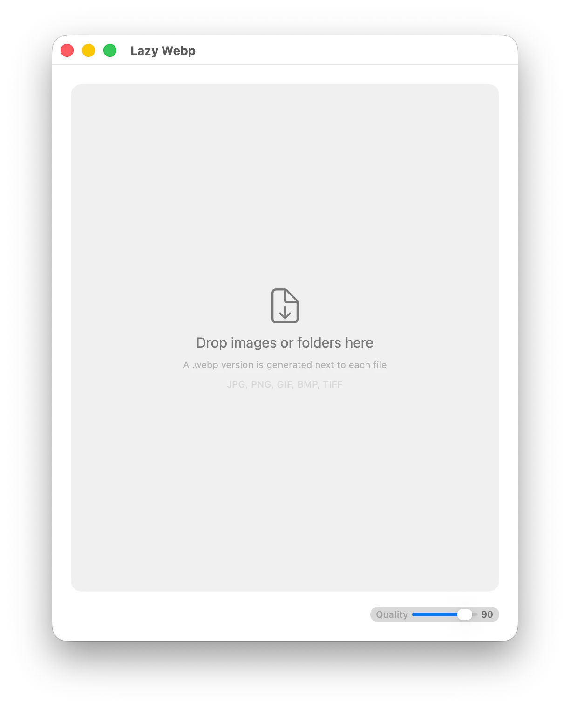
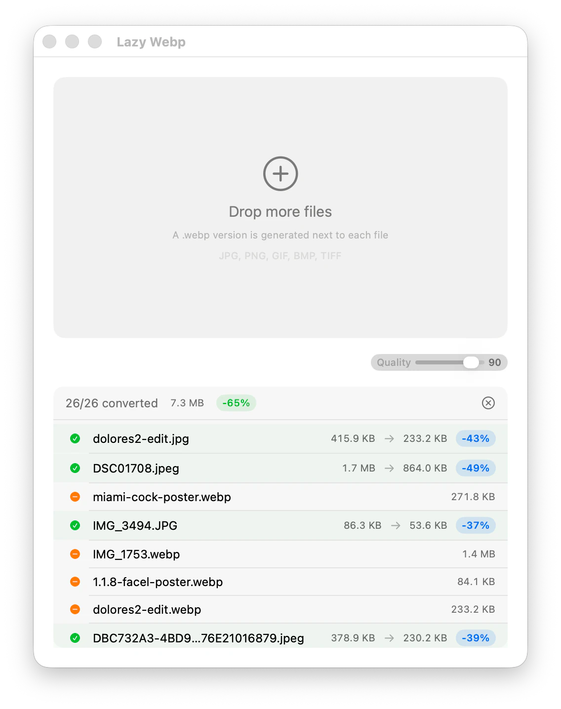

# lazywebp - image converter, CLI and macOS app

[](https://www.npmjs.com/package/lazywebp)
[](https://opensource.org/licenses/MIT)
[](https://github.com/keiver/lazywebp/actions)


<p align="center">
  
</p>

CLI tool and native macOS app to batch convert images to WebP format. Handles single files, multiple files, and entire directories with concurrent processing, atomic writes, and mtime-based skip logic.

## Quick Start

```bash
npx lazywebp photo.png
```

Converts `photo.png` to `photo.webp` in the same directory.

## Install

**Global** (adds `lazywebp` to your PATH):

```bash
npm install -g lazywebp
```

**Run without installing** (via npx):

```bash
npx lazywebp photo.png
```

**From source:**

```bash
git clone https://github.com/keiver/lazywebp.git
cd lazywebp
npm install && npm run build && npm link
```

## Usage

```bash
# Convert a single file (output next to source)
lazywebp photo.png

# Convert multiple files at once
lazywebp photo.png banner.jpg logo.gif

# Convert all images in a directory
lazywebp images/

# Convert to a separate output directory
lazywebp -o output/ images/

# Custom quality (1-100, default: 90)
lazywebp -q 80 photo.png

# Recursive subdirectory processing
lazywebp -r images/

# Combine flags
lazywebp -q 75 -r -o dist/ src/assets/
```

## Options

| Flag | Description |
|---|---|
| `-q, --quality <n>` | WebP quality 1-100 (default: 90) |
| `-o, --output <dir>` | Output directory (default: next to source) |
| `-r, --recursive` | Process subdirectories recursively |
| `-h, --help` | Show help message |
| `-v, --version` | Show version number |

## Features

- Accepts multiple input files and directories in a single command
- Skips files that haven't changed (compares mtime)
- Gracefully skips non-image files with a warning
- Atomic writes via temp file + rename
- Concurrent processing (up to 4 workers)
- Color space conversion (display-p3 / RGB to sRGB)
- Auto-rotation based on EXIF data
- Recursive subdirectory support with mirrored output structure

## Supported Formats

JPG, JPEG, PNG, GIF, BMP, TIFF, WebP

## macOS App — Lazy Webp

Native SwiftUI app that wraps the CLI. Drag and drop images or folders to convert them — output is generated next to each source file.

<p align="center">
  
</p>

### Requirements

- macOS 14+
- Swift 6.2+
- The `lazywebp` CLI must be installed and available in your PATH

### Run in development

```bash
cd app
swift run
```

### Install to /Applications

```bash
cd app
./install-app.sh
```

This builds a release binary, creates an app bundle at `/Applications/Lazy Webp.app` (`dev.keiver.lazywebp`), and signs it locally.

### App Features

- Drag-and-drop files and folders
- File picker dialog
- Quality slider (1-100)
- Per-file size and savings display
- Live progress tracking with cancel support
- Always-on-top floating window
- Menu bar icon with quick access
- Launch at login option
- Install to /Applications from the menu bar

## Requirements

| Component | Requires |
|---|---|
| CLI | Node.js 18+, Sharp |
| macOS App | macOS 14+, Swift 6.2+ |

## npm Scripts

| Script | Description |
|---|---|
| `npm run dev` | Run directly from TypeScript source |
| `npm run build` | Compile to JavaScript in `dist/` |
| `npm start` | Run compiled build |
| `npm test` | Run tests |
| `npm run test:watch` | Run tests in watch mode |

## License

MIT
